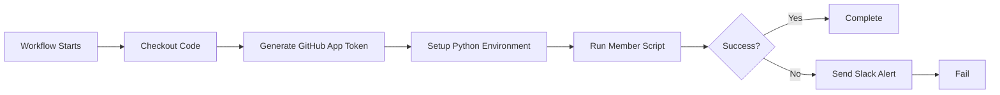

# Workflows Runbook

This runbook provides operational guidance for the Engineering Platform workflows.

## Available Workflows

### Member Management Workflows
- **`add-members-to-root-team-moj.yml`** - Adds members to root team for ministryofjustice org
- **`add-members-to-root-team-mojas.yml`** - Adds members to root team for moj-analytical-services org
- **`reusable-add-members-to-root-team.yml`** - Reusable workflow for member management

### CI/CD Workflows
- **`dependency-review.yml`** - Reviews dependency changes for security vulnerabilities
- **`lint.yml`** - Validates GitHub Actions workflows, Markdown, and YAML files
- **`ossf.yml`** - Publishes OpenSSF Scorecard findings to GitHub code scanning
- **`reusable-python-tests.yml`** - Reusable workflow for Python testing

## Member Management Workflows

### Overview

The member management workflows automatically add organization members to root teams for both `ministryofjustice` and `moj-analytical-services` organizations.

### Workflows

- **MoJ**: `add-members-to-root-team-moj.yml`
- **MoJAS**: `add-members-to-root-team-mojas.yml`
- **Reusable**: `reusable-add-members-to-root-team.yml`

### How It Works

#### 1. Trigger
The workflow can be triggered in two ways:

**Automatic (Scheduled)**:
- Runs every 2 hours during business hours (8:00, 10:00, 12:00, 14:00, 16:00 UTC)
- Monday through Friday only
- Cron schedule: `0 8,10,12,14,16 * * 1-5`

**Manual**:
- Go to Actions tab in GitHub
- Select the workflow (e.g., "🤖 Add GitHub Members to Root Team (MoJ)")
- Click "Run workflow" → "Run workflow"

#### 2. Authentication Flow



**Token Generation**:
1. Workflow reads `APP_ID` and `APP_PRIVATE_KEY` from secrets
2. Uses `actions/create-github-app-token` to generate a temporary token
3. Token is valid for 1 hour
4. Token is scoped to the specific organization
5. Token is passed to the Python script as `ADMIN_GITHUB_TOKEN`

#### 3. Execution Steps

| Step | Action | Duration | Description |
|------|--------|----------|-------------|
| 1 | Checkout | ~5s | Clones the repository code |
| 2 | Generate Token | ~2s | Creates GitHub App installation token |
| 3 | Setup Python | ~10s | Installs Python 3.11 |
| 4 | Run Script | ~1-3min | Executes member addition logic |
| 5 | Slack Notification | ~2s | On failure, posts to Slack when a webhook is configured |

**Total Runtime**: ~1-3 minutes (depending on org size)

#### 4. What the Script Does

The Python script (`scripts.add_users_all_org_members_github_team`):
1. Fetches all members of the organization
2. Identifies the root team for the organization
3. Checks which members are not in the root team
4. Adds missing members to the root team
5. Logs all actions

### Prerequisites

#### Required Secrets

| Secret Name | Type | Description | How to Get |
|------------|------|-------------|------------|
| `APP_ID` | Repository Secret | GitHub App ID | From app settings page |
| `APP_PRIVATE_KEY` | Repository Secret | Private key in PEM format | Generated when creating app |

**Adding Secrets**:
1. Go to: Settings → Secrets and variables → Actions → Secrets
2. Click "New repository secret"
3. Enter name and value
4. Click "Add secret"

#### Optional Secrets

| Secret Name | Purpose | Default Behavior |
|------------|---------|------------------|
| `SLACK_WEBHOOK_URL` | Failure notifications | No notification sent |
| `LOGGING_LEVEL` | Python logging verbosity | Uses script default |

### GitHub App Permissions Required

The GitHub App must have these permissions:

**Organization permissions**:
- Members: `Read and Write`
- Administration: `Read`

**Repository permissions**:
- Contents: `Read`

### Running the Workflow

#### Manual Run (Testing)

1. **Navigate to Actions**:
   ```
   https://github.com/ministryofjustice/ministry-of-justice-engineering-platform/actions
   ```

2. **Select Workflow**:
   - Click "🤖 Add GitHub Members to Root Team (MoJ)" or
   - Click "🤖 Add GitHub Members to Root Team (MoJAS)"

3. **Run**:
   - Click "Run workflow" button (top right)
   - Select branch: `main` (or your test branch)
   - Click "Run workflow" button

4. **Monitor**:
   - Click on the running workflow
   - Expand job "Add Members to Root Team"
   - Watch each step's progress in real-time

#### Expected Output

**Successful Run**:
```
✓ Checkout Repository
✓ Generate GitHub App Token
✓ Setup Python
✓ Run Member Addition Script
  Added 3 members to root team
  - user1
  - user2
  - user3
```

**No Changes Needed**:
```
✓ Run Member Addition Script
  All members already in root team
  No changes needed
```

### Troubleshooting

#### Common Errors

##### 1. "Bad credentials"

**Error Message**:
```
Error: Bad credentials
```

**Cause**: APP_ID or APP_PRIVATE_KEY is incorrect

**Solution**:
1. Verify APP_ID matches the app settings page
2. Regenerate private key and update secret
3. Ensure entire PEM file was copied (including BEGIN/END lines)

##### 2. "Resource not accessible by integration"

**Error Message**:
```
Error: Resource not accessible by integration
```

**Cause**: Missing GitHub App permissions

**Solution**:
1. Go to app settings → Permissions
2. Add required permissions (see above)
3. Accept permission changes in installation settings

##### 3. "Could not resolve to an Installation"

**Error Message**:
```
Error: Could not resolve to an Installation
```

**Cause**: App not installed in the organization

**Solution**:
1. Go to app settings → Install App
2. Install in the target organization
3. Verify installation is active

##### 4. Workflow fails before the member sync step

**Error Message**:
```
Error: No module named scripts.add_users_all_org_members_github_team
```

**Cause**: The workflow code and repository contents are out of sync

**Solution**:
1. Verify the repository checkout includes the `scripts/` package
2. Confirm the workflow runs against the expected branch
3. Create an issue if the workflow file and repository contents diverged

##### 5. Script timeout

**Error Message**:
```
Error: The job running on runner has exceeded the maximum execution time of X minutes
```

**Cause**: Large organization or API rate limits

**Solution**:
1. Check GitHub API rate limits
2. Consider adding delays in the script
3. Contact DevX team for optimization

#### Debugging Steps

1. **Check Workflow Logs**:
   - Go to Actions tab
   - Click on failed run
   - Review each step's output

2. **Verify Secrets**:
   ```bash
   # Check if secrets exist (shows as '***')
   # In workflow file, add debug step:
   - name: Debug
     run: |
       echo "APP_ID length: ${#APP_ID}"
       echo "Key length: ${#APP_PRIVATE_KEY}"
     env:
       APP_ID: ${{ secrets.APP_ID }}
       APP_PRIVATE_KEY: ${{ secrets.APP_PRIVATE_KEY }}
   ```

3. **Test GitHub App Locally**:
   ```bash
   # Install GitHub CLI with app extension
   gh auth login
   
   # Generate token using app
   gh api /app/installations
   ```

4. **Manual Script Run** (if you have access to the codebase):
   ```bash
   export ADMIN_GITHUB_TOKEN="your-token"
   export GITHUB_ORGANIZATION_NAME="ministryofjustice"
   python3 -m scripts.add_users_all_org_members_github_team
   ```

### Monitoring

#### Success Metrics

- **Execution Time**: Should be < 5 minutes
- **Success Rate**: Should be > 95%
- **Members Added**: Varies by org growth

#### Where to Check

1. **GitHub Actions**:
   - View all runs: Actions → Select workflow
   - Success/failure badge
   - Execution time trends

2. **Slack** (if configured):
   - Failure notifications sent to configured webhook
   - Includes job status and workflow link

#### Alerts

Set up alerts for:
- Consecutive failures (> 2)
- Execution time increase (> 10 minutes)
- Authentication errors

### Maintenance

#### Regular Tasks

| Task | Frequency | Owner | Description |
|------|-----------|-------|-------------|
| Review logs | Weekly | DevX | Check for unusual patterns |
| Test manual run | Monthly | DevX | Verify workflow still works |
| Update dependencies | Quarterly | DevX | Keep actions and Python packages current |
| Rotate app key | Annually | Security | Generate new private key |

#### Updating the Workflow

1. **Make Changes**:
   - Create feature branch
   - Edit workflow files
   - Test changes

2. **Test**:
   - Push to test branch
   - Run workflow manually from test branch
   - Verify success

3. **Deploy**:
   - Create pull request
   - Get approval
   - Merge to main

4. **Verify**:
   - Monitor next scheduled run
   - Check for errors

### Security Considerations

1. **Private Key Protection**:
   - Never commit to Git
   - Store only in GitHub Secrets
   - Rotate annually
   - Backup securely

2. **Token Lifecycle**:
   - Tokens auto-expire after 1 hour
   - Generated fresh for each run
   - Scoped to specific organization
   - No long-lived tokens

3. **Permissions**:
   - Minimum required permissions only
   - Regular permission audits
   - Document permission changes

4. **Audit Trail**:
   - All workflow runs logged
   - GitHub App actions attributed to app
   - Review logs monthly

### Disaster Recovery

#### If GitHub App is Compromised

1. **Immediate Actions**:
   - Suspend GitHub App installation
   - Rotate private key
   - Review recent activity logs

2. **Investigation**:
   - Check workflow run history
   - Review org member changes
   - Identify unauthorized changes

3. **Recovery**:
   - Create new GitHub App (if needed)
   - Update all secrets
   - Re-enable workflows
   - Monitor closely

#### If Workflow Fails Repeatedly

1. **Stop Auto-Execution**:
   - Disable the workflow in Actions settings
   - Or remove schedule trigger temporarily

2. **Investigate**:
   - Review error logs
   - Check GitHub status page
   - Test with manual run

3. **Fix**:
   - Apply fix based on error type
   - Test in development
   - Re-enable workflow

### FAQ

**Q: Can I run this workflow on a different branch?**
A: Yes, use "Run workflow" and select your branch. Note that scheduled runs always use `main`.

**Q: How do I see which members were added?**
A: Check the "Run Member Addition Script" step output in the workflow logs.

**Q: What happens if the workflow fails?**
A: Members won't be added for that run. The next scheduled run (in 2 hours) will retry.

**Q: Can I change the schedule?**
A: Yes, edit the cron expression in the workflow file. Requires code change and merge.

**Q: How do I disable the workflow temporarily?**
A: Go to Actions → Select workflow → ⋯ menu → "Disable workflow"

**Q: Does this affect existing team members?**
A: No, it only adds missing members. It never removes anyone.

**Q: Can I use this for other organizations?**
A: Yes, create a new caller workflow with the organization name. You'll need to install the app in that org.

### Support

For issues or questions:
- **Workflow Issues**: Open issue in this repository
- **GitHub App Issues**: Contact DevX team
- **Urgent Issues**: Slack #devx-platform channel
- **Security Concerns**: Follow security incident process

### Related Documentation

- [GitHub Actions Documentation](https://docs.github.com/en/actions)
- [GitHub Apps Documentation](https://docs.github.com/en/apps)
